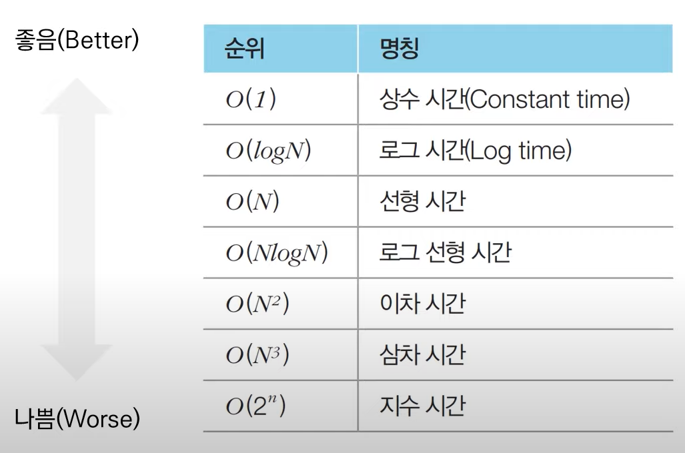

# 3주차 - 코테

날짜: 2022년 5월 28일

## 알고리즘 성능 평가

### 복잡도

복잡도는 알고리즘의 성능을 나타내는 척도

- 시간 복잡도 : 특정한 크기의 입력에 대하여 알고리즘의 수행 시간 분석
- 공간 복잡도 : 특정한 크기의 입력에 다하여 알고리즘의 메모리 사용량 분석
- 동일한 기능을 수행하는 알고리즘이 있다면, 일반적으로 복잡도가 낮을수록 좋은 알고리즘

### 빅오 표기법(Big-O Notation)

- 가장 빠르게 증가하는 항만을 고려하는 표기법.
    - 함수의 상한만을 나타나게



 

### 알고리즘 설계 Tip

- 코딩 테스트 문제에서 시간제한은 통상 1~5초
- 연산 횟수가 5억이면 파이썬은 5~15초 가량 소요

### 요구사항에 따라 적절한 알고리즘 설계하기

- 시간제한이 1초인 문제를 만났을 때
    - N의 범위가 500인 경우 시간 복잡도가 O(N^3)
    - N의 범위가 2000인 경우 시간 복잡도가 O(N^2)
    - N의 범위가 100,000인 경우 시간 복잡도가 O(NlogN)
    - N의 범위가 10,000,000인 경우 시간 복잡도가 O(N)

### 알고리즘 문제 해결 과정

1. 지문 읽기 및 컴퓨터적 사고
2. **요구사항(복잡도) 분석**
3. 문제 해결을 위한 아이디어 찾기
4. 소스코드 설계 및 코딩

### 수행 시간 측정 소스코드 예제

```python
import time
start_time - time.time() #측정 시작

#프로그램 소스코드
end_time = time.time() #측정 종료
print("time:", endtime - start_time) #수행 시간 출력
```

## 자료형

- 파이썬의 자료형
    - 정수형
    - 실수형
        - 부동소수점 오차: 2진수 체계인 컴퓨터는 실수 계산 시 오차가 발생할 수 있음
            - `round(123.456, 2)` = 123.46
    - 복소수형
    - 문자열
    - 리스트
    - 튜플
    - 사전

### 지수 표현 방식


- 1e9 = 10의 9제곱(1,000,000,000)

### 수 자료형의 연산

- 나누가 연산자(`/`)는 나눠진 결과를 실수형으로 반환
- 나머지 연산자(`%`) : 나머지를 구함
    - a가 홀수인지 체크해야 하는 경우
- 몫 연산자(`//`) : 몫을 얻음
- 거듭 제곱 연산자(`**`) : 거듭 제곱을 함

### 리스트 자료형

- 여러 개의 데이터를 연속적으로 담아 처리하기 위해 삳용하는 자료형
    - 자바의 ArrayList의 기능과 배열과 비슷한 기능을 지원
- 초기화
    - 대괄호([])안에 원소를 넣어 초기화, 쉼표로 원소를 구분
    - 비어 있는 리스트를 선언하고자 할 때는 `list()` 혹은 간단히 `[]`를 이용
    - 리스트의 원소에 접근할 때는 인덱스를 괄호에 넣음
        - 인덱스는 0부터 시작
    
    ```python
    # 직접 데이터를 넣어 초기화
    a = [1, 2, 3, 4, 5, 6, 7, 8, 9]
    print(a)
    
    # 네 번째 원소만 출력
    print(a[3])
    
    # 크기가 N이고, 모든 값이 0인 1차원 리스트 초기화
    n = 10
    a = [0] * n
    print(a)
    ```
    


- 인덱싱
    - 인덱스 값은 양의 정수와 음의 정수를 모두 넣을 수 있음
    - 음의 정수를 넣으면 원소를 거꾸로 탐색
        
        ```python
        a = [1, 2, 3, 4, 5, 6, 7, 8, 9]
        
        # 여덟 번째 원소만 출력
        print(a[7]) # 8
        
        # 뒤에서 첫번째 원소 출력
        print(a[-1]) # 9
        
        # 뒤에서 세 번째 원소 출력
        print(a[-3]) # 7
        
        # 네 번째 원소 값 변경
        a[3] = 7
        print(a) # [1, 2, 3, 7, 5, 6, 7, 8, 9]
        ```
        
- 슬라이싱
    - 연속적인 위치를 갖는 원소들을 가져와야 할 때는 슬라이싱(Slicing)을 이용
        - 대괄호 안에 콜론(`:`)을 넣어서 시작 인덱스와 끝 인덱스를 설정
        - **끝 인덱스는 실제 인덱스보다 1 높게 설정**
    
    ```python
    a = [1, 2, 3, 4, 5, 6, 7, 8, 9]
    
    # 두 번째 원소부터 네 번째 원소까지
    print(a[1 : 4]) # [2, 3, 4]
    ```
    
- 리스트 컴프리헨션
    - 리스트를 초기화 하는 방법 중 하나
        - 대괄호 안에 조건문과 반복문을 적용하여 리스트를 초기화
    
    ```python
    array = [i for i in range(10)]
    
    print(array) # [0, 1, 2, 3, 4, 5, 6, 7, 8, 9]
    
    # 0 부터 19까지의 수 중에서 홀수만 포함하는 리스트
    array = [i for i in range(20) if i % 2 ==1]
    
    # 1부터 9까지의 수들의 제곱 값을 포함하는 리스트
    array = [i * i for i in range(1, 10)]
    ```
    
    
    
- 반복문 `_` : 반복을 하되, 내부적인 변수는 무시할 때

```python
for _ in range(5):
	print("Hello")
```


- 특정 값을 가지는 원소를 모두 제거하기

```python
a = [1, 2, 3, 4, 5, 5, 5]
remove_set = {3, 5} # 집합 자료형

# remove_list에 포함되지 않는 값만을저장
result = [i for i in a if i not in remove_set]
print(result)
```

### 문자열 자료형

- 문자열 변수를 초기화할 때는 큰따옴표(`”`)나 작은 따옴표 (`'`)를 이용
- 큰따옴표는 작은따옴표 사용가능, 작은 따옴표는 큰 따옴표 사용 가능
- `+` 사용 시 문자열이 더해짐
- `*` 사용 시 그만큼 문자열이 곱해짐
- 인덱스 `a[0]`, 슬라이싱 사용 가능 `a[0:3]`
    - 하지만 문자열은 특정 인덱스의 값을 변경할 수는 없음
- f-string
    - `print(f"정답은 {answer} 입니다.")`

### 튜플

- 리스트와 유사하지만 문법적 차이가 있음
    - 한 번 선언된 값을 변경할 수 없다.
    - 리스트는 대괄호 (`[]`)를 이용하지만, 튜플은 소괄호(`()`)를 이용
- 튜플은 리스트에 비해 상대적으로 공간 효율적임.

```python
a = (1, 2, 3, 4, 5, 6, 7, 8, 9)

# 네 번째 원소만 출력
print(a[3])

# 두 번째 원소부터 네 번째 원소까지
print(a[1 : 4])
```

- 튜플을 사용하면 좋은 경우
    - 서로 다른 성질의 데이터를 묶어서 관리해야 할 때
        - 최단 경로 알고리즘에는 (비용, 노드 번호)의 형태로 튜플 자료형을 자주 사용
    - 데이터의 나열을 해싱의 키 값으로 사용해야 할 때
        - 튜플으 변겨이 불가능하므로 리스트와 다르게 키 값으로 사용 가능
    - 리스트보다 메모리를 효율적으로 사용해야 할 때

### 사전 자료형

- 키(Key) 와 값(Value)의 쌍으로 데이터로 가지는 자료형
- 변경 불가능한 자료형을 키로 사용
- `dict()` 함수로 초기화


- 사전의 Key값을 리스트로 만들때 : `data.keys()`
- 사전의 value값을 리스트로 만들 때 : `data.values()`

### 집합 자료형

- 집합의 특징
    - 중복을 허용하지 않음
    - 순서가 없음
- 초기화 방법
    - `set()`
    - `{}`

```python
# 집합 자료형 초기화 방법 1
data = set([1, 1, 2, 3, 4, 4, 5])

# 집합 자료형 초기화 방법 2
data = {1, 1, 2, 3, 4, 4, 5}
```

- 연산
    - 합집합 : `|`
    - 교집합 : `&`
    - 차집합 : `-`

```python
data = set([1, 2, 3])

# 새로운 원소 추가
data.add(4)

# 새로운 원소 여러 개 추가
data.update([5, 6])

# 특정한 값을 갖는 원소 삭제
data.remove(3)
```

### 기본 입력

- `input()` : 한 줄의 문자열을 입력 받음
- `map()` : 리스트의 모든 원소에 각각 특정한 함수를 적용할 때 사용
- 빠르게 입력 받기 : `sys.stdin.readline()`
    - 입력 후 줄 바꿈 기호가 포함되므로 `.rstrip()` 메서드 함께 사용

```python
import sys

# 데이터의 개수 입력
n = int(input())

# 각 데이터를 공백을 기준으로 구분하여 입력
data = list(map(int, input().split()))

# 문자열 입력 받기
data = sys.stdin.readline().rstrip()
```

### 기본 출력

- `print()`
    - 출력 후 줄바꿈을 하므로 원치 않을 시 `print(7, end=" ")` 와 같은 식으로 입력
    

### 조건문

- 프로그램의 흐름을 제어하는 문법
- `if 조건식:`
- **코드의 블록(Block)을 들여쓰기(Indent)로 지정**
- `if ~ elif ~ else` 순서로 적용


- 조건부 표현식
    - `result = "Success" if score >= 80 else "Fail"`
- 조건문 내에서의 부등식
    - `if 0 < x < 20:`

### 반복문

- 특정한 소스코드를 반복적으로 실행하고자 할 때
- `while`
    
    ```python
    # i가 9보다 작거나 같을 때 아래 코드를 반복적으로 실행
    while i <= 9:
        result += i
    i += 1
    ```
    
- `for`
    - 특정한 변수를 이용하여 ‘in’ 뒤에 오는 데이터에 포함되어 있는 원소를 첫 번째 인덱스부터 차례대로 하나씩 방문.
    
    ```python
    array = [9, 8, 7, 6, 5]
    
    for x in array:
        print(x)
    ```
    
    - `range()`
        - 연속적인 값을 차례대로 순회할 때 사용
        - `range(시작값, 끝값+1)`
        - 인자를 하나만 넣으면 자동으로 시작 값은 0이 됨
- `continue`
- `break`

### 함수

- 함수 : 특정한 작업을 하나의 단위로 묶어 놓은 것
- 함수를 사용하면 불필요한 소스코드의 반복을 줄일 수 있음
- 함수의 종류
    - 내장 함수 : 파이썬이 기본적으로 제공하는 함수
    - 사용자 정의 함수 : 개발자가 직접 정의하여 사용할 수 있는 함수

```python
def 함수명(매개변수):
    실행할 소스코드
		return 반한 값
```

- `global`
    - 함수 바깥에 선언된 변수를 사용하려면 사용해야 함
    
    ```python
    a = 10
    
    def func():
    		global a
    		a += 1
    		print(a)
    
    func()
    ```
    
- 함수는 여러 개의 반환 값을 가질 수 있음
    
    
    

### 람다 표현식

- 람다 표현식을 이용하면 함수를 간단하게 작성할 수 있음
- `print((lambda a, b: a + b)(3, 7))`

```python
array = [('홍길동', 50), ('이순신', 32), ('아무개', 74)]

def my_key(x):
	return x[1]

print(sorted(array, key=my_key))
print(sorted(array, key=lambda x: x[1]))
```

### 실전에서 유용한 표준 라이브러리

- 내장 함수 : 기본 입출력 함수, 정렬
- itertools : 파이썬에서 반복되는 형태의 데이터를 처리하기 위한 유용한 기능 제공
    - 순열, 조합 라이브러리
- heapq : 힙 자료구조 제공
    - 우선순위 큐 기능 구현하기 위해 사용
- bisect : 이진 탐색 (Binary Search) 기능 제공
- collections : 덱(deque), 카운터(Counter)
- math : 필수적인 수학적 기능 제공
    - 팩토리얼, 제곱근, 최대공약수, 삼각함수, 파이

```python
# sum()
result = sum([1, 2, 3, 4, 5]) # 15

# min(), max()
min_result = min(7, 3, 5, 2) # 2
max_result = max(7, 3, 5 ,2) # 7

# eval()
result = eval("(3+5)*7") # 56

# sorted()
result = sorted([9, 1, 8, 5, 4]) #[1, 4, 5, 8, 9]
reverse_result = sorted([9, 1, 8, 5, 4], reverse=True) # [9, 8, 5, 4, 1]

# sorted() with key
array = [('홍길동', 50), ('이순신', 32), ('아무개', 74)]
print(sorted(array, key=lambda x: x[1]))
```

- 순열 : 서로 다른 n개에서 서로 다른 r개를 선택하여 일렬로 나열하는 것
- 조합 : 서로 다른 n개에서 순서에 상관 없이 서로 다른 r개를 선택하는 것


```python
# 순열
from itertools import permutations
data = ['A', 'B', 'C']
result = list(permutations(data, 3)) # 모든 순열 구하기

# 조합
from itertools import combinations
data = ['A', 'B', 'C']
result = list(combinations(data, 2)) # 2개를 뽑는 모든 조합 구하기

# 중복 순열
from itertools import product
data = ['A', 'B', 'C']
result = list(product(data, repeat=2)) # 2개를 뽑는 모든 순열 구하기 (중복 허용)

# 중복 조합
from itertools import combinations_with_replacement
data = ['A', 'B', 'C']
result = list(combinations_with_replacement(data, 2)) # 2개를 뽑는 모든 조합 구하기 (중복허용)

```

- Counter
    - 등장 횟수를 세는 기능 제공
    
    ```python
    from collections import Counter
    
    counter = Counter(['red', 'blue', 'red', 'green', 'blue', 'blue'])
    print(counter['blue']) # 'blue'가 등장한 횟수 출력
    print(counter['green']) # 'green'이 등장한 횟수 출력
    print(dict(counter) # 사전으로 반환
    ```
    
- 최대 공약수와 최소 공배수
    
    ```python
    import math
    
    # 최소 공배수(LCM)를 구하는 함수
    def lcm(a, b):
    	return a * b // math.gcd(a, b)
    
    a = 21
    b = 14
    
    print(math.gcd(21, 14) # 최대 공약수(GCD) 계산
    print(lcm(21, 14) # 최소 공배수(LCM) 계산
    ```